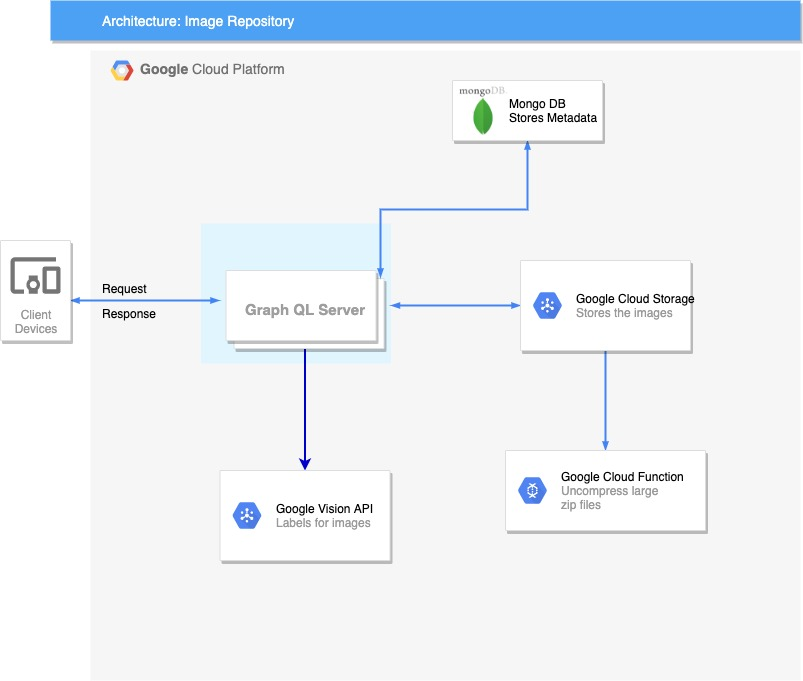

### TASK: Build an image repository.

Following features have been implemented

1. SEARCH function

- from characteristics of the images
- from text
- from an image (search for similar images)

2. ADD image(s) to the repository

- one / bulk / enormous amount of images
- private or public (permissions)
- secure uploading and stored images

3. DELETE image(s)

- one / bulk / selected / all images
- Prevent a user deleting images from another user (access control)
- secure deletion of images

### How to set up the project:

- Add a file config.js. A template is added to the repository called config-example.js
- You will also need to create a Google Cloud account and create a bucket for google cloud storage. After that you will also need to create a service account and download the json file, name it service-account-key and add it to the root folder.
- Please ensure to specify your project name and bucket name in config.js
- After creating the google cloud account, you will have to enable 2 API's in google cloud i.e. Vision API and Google Cloud Function. We use vision api to assign labels to the image uploaded so as to be able to search it and google cloud function to uncompress the zip file which is used for uploading large amount of files.

### How to run the project

- Simply run npm start. A graphql playground would open at localhost:5000.
- In the playground, you will also find the documentation of available queries and mutation by clicking on Docs on the right
- Sample flow of the application

1. Create a user using the following Mutation

```
mutation {
  register(registerInput: {
    username: "xyz"
    password: "123456"
    confirmPassword: "123456"
    email: "xyz@gmail.com"
  }) {
    id
    email
    token
    username
    createdAt
  }
}
```

2. Login using the credentials of the user created above using following mutation

```
mutation {
  login(username: "xyz", password:"123456") {
    id
    email
    token
    username
    createdAt
  }
}
```

Store the token returned from the above mutation. We will need it to upload/delete images

3. Upload single image or a directory of lots of images. The parameter needed is the path of the file on your local disk and an option to either make the image public or not.You will need the token from login mutation for this. Add it in your http headers(option on the bottom of the playground), in the following format:

```
{
  "Authorization":"Bearer token"
}
```

Should include the word Bearer followe by a space and then the token from the login mutation.

Use the mutation as shown below to upload single image file.

```
mutation uploadImage {
  uploadImage(file: "dog2.jpeg" public: true) {
    id
    username
    createdAt
    imageUrl
    labels
  }
}
```

The imageUrl above will only be accessed by the user who uploaded the file if public is specified false. If public is true, anyone with the link will be able to view the image

In order to upload enormous amount of images, specify the path of the directory you wish to upload. All files inside the directory will be uploaded.

```
mutation uploadDirectory {
  uploadDirectory(dir: "images") {
    imageUrl
  }
}
```

4. You will only be able to get the images that the currently logged in user has uploaded.
   You can get the information of the image you wish to get as such:

```
query getImages {
  getImages {
    id
    imageUrl
  }
}
```

In order to get a single image, you need to specify the image id and use the query as such:

```
query getImage {
  getImage(imageId: "5da37ebeebde0c7f0752e16b") {
    id
    imageUrl
  }
}
```

5. You have the ability to search the images either by text or by another image. In order to search for the image by text, you can use the folllowing query (you will only get images uploaded by the current user):

```
query searchImage {
  searchImage(text: "Dog") {
    imageUrl
  }
}
```

In order to search for images by another image (reverse image search), you need to specify the file parameter which is the path of the image you want the search to be performed from in your query as such:

```
query reverseSearch {
  reverseImageSearch(file: "dog1.jpeg") {
    imageUrl
  }
}
```

6. In order to delete an image, you will need the imageId. You can get the image id by querying get Images.
   Use the mutation as such to delete the image:

```
mutation deleteImage {
  deleteImage(imageId:"5da4ea89fc2febbf4b44508e" )
}
```

In order to delete multiple images you need to provide an array of image ids that you want deleted. You can use it as such:

```
mutation deleteImages {
  deleteImages(imagesIds: [1234, 12456, 0932])
}
```

### Architecture Decision



- Images are static and would not change/updated once stored. Hence, I was debating either storing them as a blob or storing them directly in the file system. I decided to store them in Google cloud storage bucket because it gives great isolation between data of different users. This patttern is very similar to the one Shopify may be using in order to store the data of different merchants and yet at the same time ensure isloation between their data.

- Our repository structures is as such: data/username/file.jpg

- Google cloud storage also gives us great access control and every file can either be public or private for that particular user which is also the desired functionality for us.

- When a client uploads an image, we store all the metadata related to this image in MongoDB. This metadata includes imageUrl (stored in google cloud storage of the format storage.api.com/data/username/file.jpg), username, ref to user, labels which we get from the google cloud vision api, created at, etc

- The labels from the google vision api help us with the search functionality. When searching throguh an image as well, we get label for that image and then search for labels on MongoDB. I did consider and worked on exposing our own end point to calculate the features using pre-trained models like MobileNet, which we could use to calculate labels, however the latency was too high and the time taken to resolve each requests was maginutdes higher than our current implementation.

- In case of uploading a large amount of request, I was considering either a batch request, however I found that making a single request of a large zip file was better in terms of latency. In order to unzip the zip file, we make use of Google cloud function which are triggered when we upload a file. If the file is of type zip, it will run our uncompress function defined on google cloud.

### Future Consideration

- Add functionality for managing inventory, buy and sell images
- Add admin user who can search through entire repository
- Containerize the app and deploy on k8s
- Add client to display images for users (WIP)
- Add more test cases and reach 100% coverage
